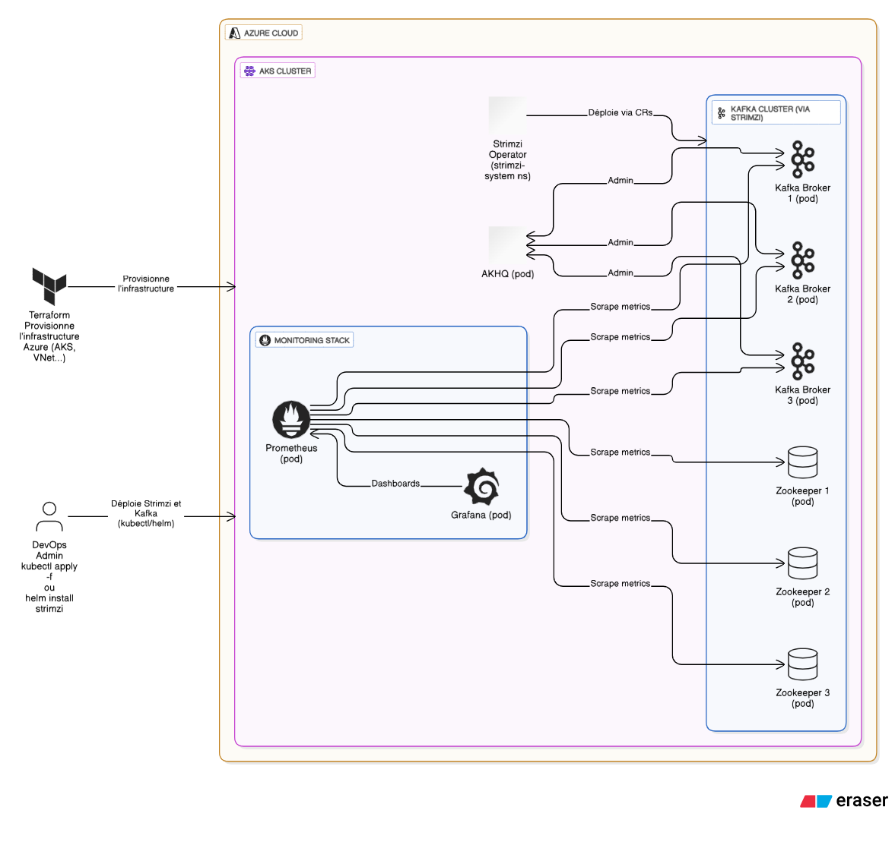

# ☸️ Déploiement Kafka avec Strimzi + Monitoring + EFK

Ce projet permet de déployer une infrastructure **Kafka sur Kubernetes** avec les composants suivants :

- 🟢 **Kafka & Zookeeper** déployés via l'opérateur **Strimzi**
- 📊 **Monitoring** via **Prometheus + Grafana**
- 📁 **Centralisation des logs** des pods (Kafka, Zookeeper, etc.) avec la stack **EFK** (Elasticsearch, Fluentd, Kibana)

---


## 📂 Arborescence

```bash
automatiser-infra-kafka/
├── strimzi/             # Manifests Kafka, Zookeeper, opérateur Strimzi
├── efk/                 # Stack Elasticsearch / Fluentd / Kibana
├── monitoring/          # Prometheus, Grafana, AlertManager, ServiceMonitors
├── terraform-aks/       # Déploiement de l’infra AKS 
├── k8s-management.sh    # Script pour gerer cluster k8s
```
## terraform.tfvars
```bash

---

## ⚙️ Fichier `terraform.tfvars` requis

Avant d'exécuter le script Terraform, crée un fichier `terraform.tfvars` dans le dossier `terraform-aks/` avec le contenu suivant (à adapter selon ton environnement) :

```hcl
vnet_cidr               = "10.0.0.0/16"
aks_subnet_cidr         = "10.0.1.0/24"
network_plugin          = "azure"
service_cidr            = "10.2.0.0/16"
dns_service_ip          = "10.2.0.10"
dns_prefix              = "myaksdns"
node_count              = 2
vnet_name               = "myVnet"
subnet_name             = "mySubnet"
nsg_name                = "myNSG"
location                = "francecentral"
default_node_pool_name  = "default"
aks_name                = "kafka-cluster"
resource_group_name     = "devoteam-rg"
vm_size                 = "Standard_B4ms"
subscription_id         = "votre-subscription-id"

#Standard_B4ms → 4 vCPU, 16 Go RAM
#Standard_B2ms → 2 vCPU, 8 Go RAM
#Standard_B2s → 2 vCPU, 4 Go RAM
```
## 🚀 Déployer le cluster Kubernetes (AKS) avec Terraform
```bash
cd terraform-aks/
terraform init
terraform apply
```
## Configurer l’accès au cluster
```bash
az aks get-credentials --resource-group devoteam-rg --name kafka-cluster
```

## Déploiement des composants sur Kubernetes
```bash
# 1. Déploiement de Kafka + Zookeeper via Strimzi
cd ../strimzi/
./script-kafka.sh

# 2. Déploiement du monitoring (Prometheus + Grafana)
cd ../monitoring/
./script-monitoring.sh

# 3. Déploiement de la stack EFK (Elasticsearch, Fluentd, Kibana)
cd ../efk/
./deploy-efk.sh
```